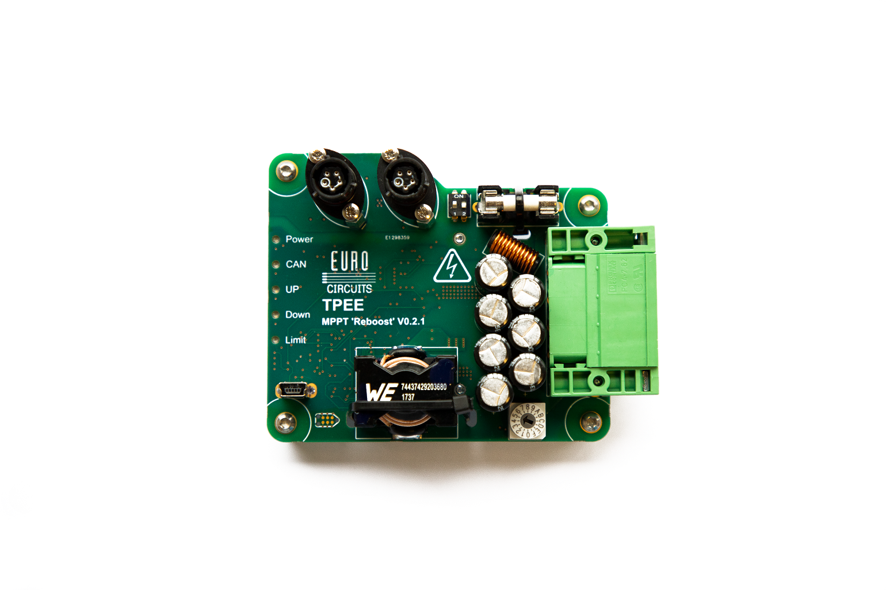

# ReboostV2-Hardware
Hardware files for [OpenSmartEnergyConverter](https://github.com/TjitteS/OpenSmartEnergyConverter)

[Schematic](https://github.com/TjitteS/ReboostV2-Hardware/blob/main/Outputs/Reboost%20V0.2.1/Schematic%20Prints.PDF) and production files can be found in the output folder.

### Verison ###

The output folder contains two verison. the only major diference between the two versions is the CAN-bus connector that is used. V0.2.0 contains easy to source microfit connectors and is the recomended design.
